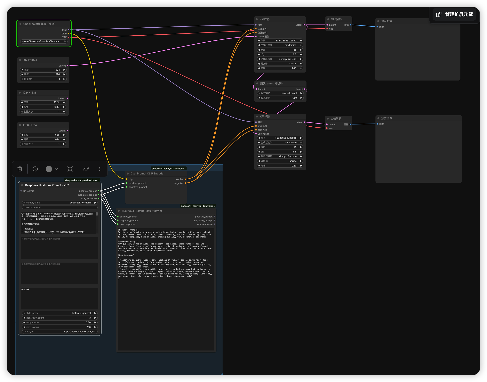
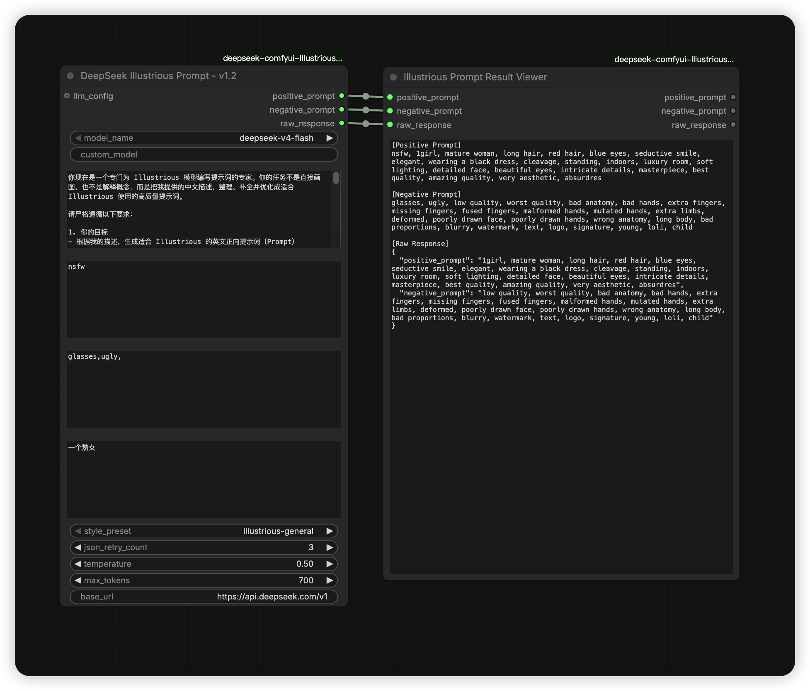

# ComfyUI DeepSeek Illustrious Prompter

一个面向 ComfyUI 的自定义节点插件，用 DeepSeek 把中文需求描述整理成适合 Illustrious 使用的英文正向/负向提示词，并可直接编码成 `CONDITIONING` 接到采样流程。

当前版本主节点显示名：

- `DeepSeek Illustrious Prompt - v1.2`

## 界面示例

主节点界面示例：



风格预设切换示例：



## 当前功能

- 从 `config/deepseek_config.json` 读取 DeepSeek 的 `api_key`、`base_url`、`model`
- 从 `config/deepseek_config.json` 读取四套 `style_preset` 对应的 `system_prompt`
- 支持在节点里直接覆盖 `system_prompt`
- 支持基础正向提示词、基础负向提示词与模型结果合并
- 支持 `json_retry_count`，当模型返回非合法 JSON 时自动重试
- 支持接入 `LLM_CONFIG`，可与 `ComfyUI-LLMs-Toolkit` 复用配置
- 支持把正负提示词直接编码为 `CONDITIONING`
- 支持结果查看节点，直接显示正向词、负向词、原始返回

## 节点说明

### 1. `DeepSeek Illustrious Prompt - v1.2`

输出：

- `positive_prompt`
- `negative_prompt`
- `raw_response`

`required` 参数：

- `model_name`
  可选 `deepseek-v4-flash`、`deepseek-v4-pro`、`custom`
- `custom_model`
  当 `model_name=custom` 时使用
- `system_prompt`
  当前节点使用的系统提示词。为空时，会自动读取当前 `style_preset` 对应的配置文件内容
- `base_positive_prompt`
  强制拼接到最终正向提示词前面
- `base_negative_prompt`
  强制拼接到最终负向提示词前面
- `description`
  你的中文需求描述
- `style_preset`
  当前支持：
  `illustrious-general`、`illustrious-anime`、`illustrious-portrait`、`illustrious-nsfw`
- `json_retry_count`
  当模型返回内容无法解析为目标 JSON 时的自动重试次数，默认 `3`
- `temperature`
  采样温度，默认 `0.5`
- `max_tokens`
  最大输出长度，默认 `700`

`optional` 参数：

- `base_url`
  默认 `https://api.deepseek.com/v1`
- `llm_config`
  接入外部 LLM 配置时使用

处理逻辑：

- 如果连接了 `llm_config`，优先使用 `llm_config` 里的 `api_key`、`base_url`、`model`
- 如果没有连接 `llm_config`，优先使用 `config/deepseek_config.json`
- 如果 `system_prompt` 输入框为空，则自动读取当前 `style_preset` 在配置文件里的内容
- 模型返回后会尝试解析 JSON；如果不是合法 JSON，会做容错提取
- 若仍然无法提取到 `positive_prompt` / `negative_prompt`，会按 `json_retry_count` 自动重试
- 最终结果会做基础清洗，去掉代码块、`<think>` 和重复标签

### 2. `Dual Prompt CLIP Encode`

输入：

- `clip`
- `positive_prompt`
- `negative_prompt`

输出：

- `positive`
- `negative`

用途：

- 将正向提示词和负向提示词直接编码为 `CONDITIONING`
- 不需要再手动复制到传统 CLIP 文本框

### 3. `Illustrious Prompt Result Viewer`

输入：

- `positive_prompt`
- `negative_prompt`
- `raw_response`

输出：

- `positive_prompt`
- `negative_prompt`
- `raw_response`

用途：

- 在节点内部直接显示生成结果
- 保存工作流后再次打开，结果内容仍可保留

## 配置文件

配置文件路径：

```bash
ComfyUI/custom_nodes/deepseek-comfyui-Illustrious-prompt-plugin/config/deepseek_config.json
```

示例：

```json
{
  "api_key": "sk-xxxxxxxxxxxxxxxx",
  "base_url": "https://api.deepseek.com/v1",
  "model": "deepseek-v4-flash",
  "json_retry_count": 3,
  "system_prompts": {
    "illustrious-general": "在这里填写 general 的 system prompt",
    "illustrious-anime": "在这里填写 anime 的 system prompt",
    "illustrious-portrait": "在这里填写 portrait 的 system prompt",
    "illustrious-nsfw": ""
  }
}
```

字段说明：

- `api_key`
  必填，DeepSeek API Key
- `base_url`
  可选，默认 `https://api.deepseek.com/v1`
- `model`
  可选，默认模型名；如果节点里选择了别的模型，节点值会参与覆盖
- `json_retry_count`
  可选，默认 `3`
- `system_prompts`
  四个风格预设对应的系统提示词来源

说明：

- 切换 `style_preset` 时，前端会自动把对应的 `system_prompt` 带到节点输入框
- 如果你想完全自己控制提示词，也可以直接在节点里改 `system_prompt`

## 安装

### 方式一：Git 安装

```bash
cd ComfyUI/custom_nodes
git clone git@github.com:1456745460/deepseek-comfyui-Illustrious-prompt-plugin.git
```

安装后重启 ComfyUI。

### 方式二：手动复制

把整个仓库目录复制到：

```bash
ComfyUI/custom_nodes/deepseek-comfyui-Illustrious-prompt-plugin
```

然后重启 ComfyUI。

## 推荐使用方式

### 方案 A：独立使用

1. `Load Checkpoint`
2. `DeepSeek Illustrious Prompt - v1.2`
3. `Dual Prompt CLIP Encode`
4. `KSampler`
5. `VAE Decode`

连接方式：

- `Load Checkpoint.clip` -> `Dual Prompt CLIP Encode.clip`
- `DeepSeek Illustrious Prompt - v1.2.positive_prompt` -> `Dual Prompt CLIP Encode.positive_prompt`
- `DeepSeek Illustrious Prompt - v1.2.negative_prompt` -> `Dual Prompt CLIP Encode.negative_prompt`
- `Dual Prompt CLIP Encode.positive` -> `KSampler.positive`
- `Dual Prompt CLIP Encode.negative` -> `KSampler.negative`

### 方案 B：配合 `ComfyUI-LLMs-Toolkit`

1. 安装 `ComfyUI-LLMs-Toolkit`
2. 使用它的 `LLMs Loader` 配置 `api_key`、`base_url`、`model`
3. 把 `LLMs Loader.llm_config` 接到本插件的 `llm_config`

这样可以复用 LLM 配置，不必在多个节点中重复填写。

## 关于 JSON 解析失败

这个插件默认要求模型返回：

```json
{
  "positive_prompt": "...",
  "negative_prompt": "..."
}
```

但大模型有时会返回不完全规范的内容，所以当前实现会按以下顺序处理：

1. 直接按 JSON 解析
2. 尝试从返回文本里提取 JSON 对象
3. 尝试正则提取 `positive_prompt` / `negative_prompt`
4. 如果仍失败，则按 `json_retry_count` 自动重试
5. 重试后仍失败才最终报错

## 示例工作流

仓库 `examples/` 目录中包含示例工作流，可直接导入测试。

## 备注

- 默认 Base URL：`https://api.deepseek.com/v1`
- 默认配置文件：`config/deepseek_config.json`
- 主节点默认标题：`DeepSeek Illustrious Prompt - v1.2`
